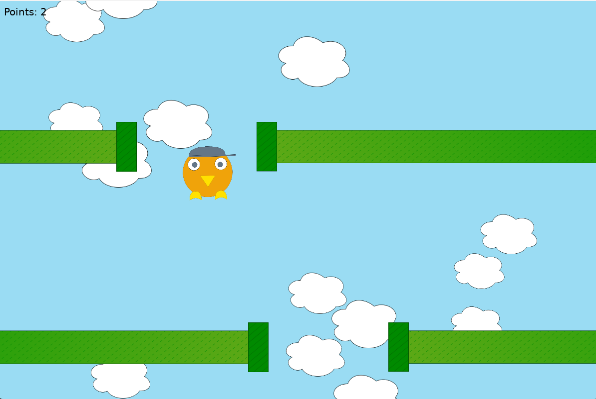

# Falling Bird

Falling Bird is a game that is like flappy bird but with a falling bird. The game was made with lua using love2d. All of the assets are self made. Try to set your personal highscore!

 

# Features
- Play a round of falling bird
- Get Points and retry
- Parallax clouds in the background
- Control the bird with W/D or Left/Right arrow key
- See Debug stats via F5

## Screenshot
 

# Run
- Play the game on https://falling.jamedev.top
- Build it yourself and run it via love

# Development
This game was made using
- Lua 5.4.8
- Love2D 11.5

# License
This project is published under the [MIT LICENSE](LICENSE)

# Other
This project is made for hackclubs siege event main week 4 (week 8 total)